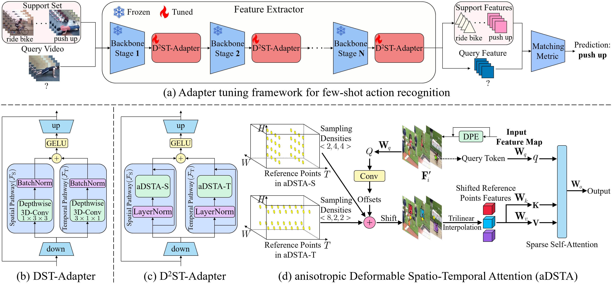

# [ICCV2025] D$^2$ST-Adapter: Disentangled-and-Deformable Spatio-Temporal Adapter for Few-shot Action Recognition

[📖 Paper](https://arxiv.org/abs/2312.01431)



> **Abstract**: *Adapting pre-trained image models to video modality has proven to be an effective strategy for robust few-shot action recognition. In this work, we explore the potential of adapter tuning in image-to-video model adaptation and propose a novel video adapter tuning framework, called Disentangled-and-Deformable Spatio-Temporal Adapter (D$^2$ST-Adapter). It features a lightweight design, low adaptation overhead and powerful spatio-temporal feature adaptation capabilities. D$^2$ST-Adapter is structured with an internal dual-pathway architecture that enables built-in disentangled encoding of spatial and temporal features within the adapter, seamlessly integrating into the single-stream feature learning framework of pre-trained image models. In particular, we develop an efficient yet effective implementation of the D$^2$ST-Adapter, incorporating the specially devised anisotropic Deformable Spatio-Temporal Attention as its pivotal operation. This mechanism can be individually tailored for two pathways with anisotropic sampling densities along the spatial and temporal domains in 3D spatio-temporal space, enabling disentangled encoding of spatial and temporal features while maintaining a lightweight design. Extensive experiments by instantiating our method on both pre-trained ResNet and ViT demonstrate the superiority of our method over state-of-the-art methods. Our method is particularly well-suited to challenging scenarios where temporal dynamics are critical for action recognition.*

This code is based on [MoLo](https://github.com/alibaba-mmai-research/MoLo), which provides a comprehensive video understanding solution for few-shot action recognition.

## Installation

```
# create virtual environment
conda create -n D2ST-Adapter python=3.7
conda activate D2ST-Adapter

# install pytorch
pip install torch==1.8.0+cu111 torchvision==0.9.0+cu111 torchaudio==0.8.0 -f https://download.pytorch.org/whl/torch_stable.html

# install CLIP
pip install git+https://github.com/openai/CLIP.git

# install other requirements
pip install -r requirements.txt
```

## Data Preparation

Download the following datasets from their original source and put them into [data](./data/) folder.

- [SSv2](https://www.qualcomm.com/developer/software/something-something-v-2-dataset) (which is the original dataset of both the SSv2-full and SSv2-small datasets)
- [Kinetics-400](https://github.com/Showmax/kinetics-downloader) (which is the original dataset of the Kinetics-100 dataset)
- [HMDB51](https://serre-lab.clps.brown.edu/resource/hmdb-a-large-human-motion-database/#Downloads)
- [UCF101](https://www.crcv.ucf.edu/data/UCF101.php)

## Training

The commands for running experiments on different datasets with various backbones are as follows:

```
python runs/run.py --cfg config/ssv2_full/ResNet_SSv2_full.yaml
python runs/run.py --cfg config/ssv2_full/ViT_SSv2_full.yaml

python runs/run.py --cfg config/kinetics100/ResNet_K100.yaml
python runs/run.py --cfg config/kinetics100/ViT_K100.yaml

python runs/run.py --cfg config/ssv2_small/ResNet_SSv2_small.yaml
python runs/run.py --cfg config/ssv2_small/ViT_SSv2_small.yaml

python runs/run.py --cfg config/hmdb51/ResNet_HMDB51.yaml
python runs/run.py --cfg config/hmdb51/ViT_HMDB51.yaml

python runs/run.py --cfg config/ucf101/ResNet_UCF101.yaml
python runs/run.py --cfg config/ucf101/ViT_UCF101.yaml
```

## Citation

```
@article{pei2023d,
  title={D $\^{} 2$ ST-Adapter: Disentangled-and-Deformable Spatio-Temporal Adapter for Few-shot Action Recognition},
  author={Pei, Wenjie and Tan, Qizhong and Lu, Guangming and Tian, Jiandong},
  journal={arXiv preprint arXiv:2312.01431},
  year={2023}
}
```